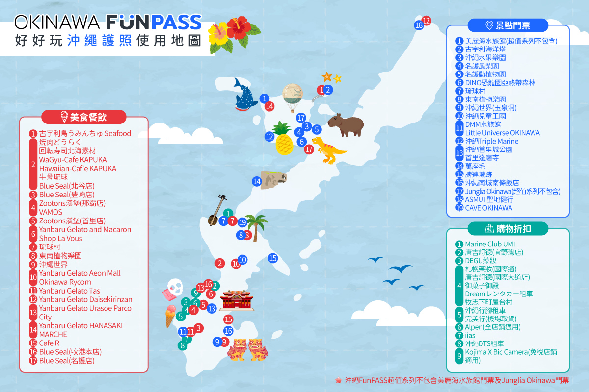

# 沖繩家族旅遊｜2027/1/14（四）– 1/18（一）

**3 大 1 小**：爸 68、媽 66、我 36、小孩 9　·　**駕駛只有 1 人（我）**
全員台北出發，樂桃直飛　·　**住宿只搬一次**：那霸 2 晚 → 美國村 2 晚
線上版 👉 https://ellishou.github.io/familytrip/

---

## ✈ 機票

| 去／回 | 航班 | 時間 | 備註 |
|---|---|---|---|
| 去 | **MM922** | 台北 `09:45` → 那霸 `12:25` | ⚠️ **07:45 報到** |
| 回 | **MM929** | 那霸 `16:50` → 台北 `17:35` | 下午走，最後一天還有半天 |

✅ **長輩 1/13 住台北家，1/14 一早全家一起搭 KKday 機場接送到桃園機場。**

- 🕖 **07:00 出車 → 約 07:40 到機場**（之前搭過同一時段，車程 40 分鐘）；樂桃櫃台 **07:45 開**，一到就排第一批
- ⚠️ **車型要換**：上次訂的是「經濟四人座車」**限 1–3 人搭乘**，這次 4 個人坐不下 → 要改 **5 人座以上／休旅車**，備註 **4 人 + 4 件行李**
- 📅 KKday **改時間要在原預約日 4 天前**聯繫客服

---

## 🚗 交通

```
沖繩行腳（小祿站）　1/14 13:00 取車 → 1/18 13:00 還車
= 96 小時 = 4 天整　（多一分鐘就跳第 5 天，+¥11,000）
```

- **車型：✅ 新款 SIENTA（7 人座）** —— 4 天 ¥44,000 + 保險 ¥8,800 + ETC ¥3,700 = **¥56,500**
  - 4 人的話 SUV（¥50,500）也坐得下，但**第三排折下來才有真正的行李廂**，多 ¥6,000 值得
  - 車高約 **1.70m** → 那霸飯店停車場的限高要先確認
- 還車後**免費接駁送機場**
- 駕照**日文譯本只要辦 1 份**

---

## 📅 行程

### Day 1｜1/14（四）抵達 · 瀨長島 · iias 豊崎 · 那霸

| 時間 | | |
|---|---|---|
| 07:00 | 🚗 交通 | **機場接送出車**（台北家 → 桃園機場，約 40 分） |
| 07:40 | ✈ 航班 | 抵達桃園 T1；樂桃櫃台 **07:45 開**，排第一批報到 |
| 09:45 | ✈ 航班 | **MM922** 台北 → 那霸 |
| 12:25 | ✈ 航班 | 落地那霸機場，入境、領行李 |
| 13:00 | 🚗 交通 | **沖繩行腳取車**（免費接駁從機場到小祿營業所） |
| 13:30 | 📍 景點 | **瀨長島 Umikaji Terrace**　★ 必訪 —— 離機場 10 分，看飛機起降、海景商店街，**午餐在這裡吃**<br>🍜 **備案（都在小祿，取車後 5 分鐘內）**：**通堂拉麵 小祿本店**（人氣豚骨，男味／女味兩種湯頭）或 **AEON 那霸店（小祿）**（美食街 + 超市，室內有電梯）—— 長輩想先吃點熱的、或瀨長島風大太冷就先在小祿解決 |
| 15:10 | 🛍 購物 | **iias 沖繩豊崎**　○ 彈性（**車程只要 10 分**）—— 就在瀨長島隔壁；室內、電梯、免費停車、座位多，超市藥妝 UNIQLO 都有<br>（館內的 DMM かりゆし水族館不排，1/17 已有美麗海） |
| 16:30 | 🛍 購物 | **ASHIBINAA Outlet（沖繩暢貨中心）**　○ 彈性（**車程 3 分，就在 iias 隔壁**）—— 沖繩唯一的 Outlet，約 100 家品牌、免費停車<br>⚠️ **半露天的開放式商場**，1 月晚上會冷；**iias 和 Outlet 擇一逛就好**<br>💡 想買衣服鞋子走 Outlet、想買超市藥妝走 iias |
| 17:30 | 🚗 交通 | 往那霸（25 分） |
| 18:00 | 🏨 住宿 | 國際通飯店 check in |
| 18:50 | 🍽 用餐 🛍 購物 | **國際通散策**、晚餐；飯店旁就是**ユニオン超市** |

> **這天唯一的必訪是瀨長島**（離機場 10 分、午餐在那裡吃）。iias 和 Outlet **兩個都是彈性**：想逛就擇一（相距 3 分），**長輩累了就 15:00 直接回飯店休息** —— 伴手禮 1/16 在 Rycom 會買齊、藥妝 1/15 晚上國際通也買得到，提早進房完全不可惜。
> 全天車程 55 分、單段最長 25 分。

### Day 2｜1/15（五）那霸市區輕鬆日　⭐ 全天只開 45 分鐘

| 時間 | | |
|---|---|---|
| 09:20 | 🍽 用餐 | **福助の玉子焼き**　○ 彈性（安里／牧志一帶，**走路就到**）—— 買**豬肉蛋飯糰**當車上點心<br>⚠️ **早上開、賣完就收**，可能要排隊 —— 想買就早點下樓，不然就跳過直接出發 |
| 09:30 | 🚗 交通 | 國際通 → 波上宮（10 分，全程平面道路） |
| 09:45 | 📍 景點 | **波上宮**　★ 必訪（50 分）—— 沖繩總鎮守，建在斷崖上，**境內平坦好走、有自己的停車場** |
| 10:45 | 📍 景點 | **沖宮・奧武山公園**　○ 彈性（車程 5 分 · 停 30 分）—— 琉球八社之一，腹地大好停車；累了直接跳過 |
| 11:45 | 🚗 交通 | 往浦添（20 分） |
| 12:10 | 🍽 用餐 🛍 購物 | **San-A 浦添西海岸 PARCO CITY**　★ 必訪 —— **午餐在美食街解決**，逛一整個下午（免費停車、室內冷暖氣、電梯、座位多） |
| 16:00 | 🚗 交通 | 回國際通（15 分） |
| 16:20 | 🏨 住宿 | 回飯店，長輩可以先回房休息 |
| 18:00 | 🍽 用餐 🛍 購物 | 國際通晚餐、**市場本通／國際通屋台村**<br>🏮 **市場本通**是**有頂棚的拱廊**，下雨風大都能逛、地面平好走；**屋台村**二十幾家小店聚在一起，氣氛好<br>⚠️ 屋台村**店面小、座位窄、多半要併桌** —— 長輩久坐不舒服就當逛過去看看，正餐回國際通或市場本通吃<br>💡 **第一牧志公設市場移出**：一樓生鮮攤 18:00 前後陸續收攤，晚上過去看不到東西<br>🍗 **備選：鳥貴族 那覇国際通り店** —— 均一價烤雞串居酒屋，**全店禁菸**、菜單有圖、價格好抓；晚餐時段建議先訂位<br>💊 **ドラッグイレブン 國際通店** —— 沖繩在地藥妝連鎖，**營業到很晚**，就在散策路線上；藥品、保養品、零食、沖繩限定伴手禮都有，**可退稅**<br>👉 **這天買藥妝最剛好**：1/16 要換飯店、之後都在北谷，國際通只有兩個晚上<br>⚠️ **退稅品買了不能拆封使用**，要原封帶到 1/18 機場海關；當場要用的（感冒藥、痠痛貼布）就正常付稅買 |

> **不排奧武島、知念岬、齋場御嶽、玉泉洞** —— 南部那圈太繞，來回多開 1 小時以上，後兩者石階又多。
> 這天是刻意留的緩衝日：長輩前一天剛飛完，不想出門也能直接在國際通待一整天。

### Day 3｜1/16（六）換飯店 → 美國村　🧳 唯一一次換飯店

| 時間 | | |
|---|---|---|
| 09:00 | 🍽 用餐 | **飯店早餐慢慢吃** —— 這天不用趕，吃飽再整理行李<br>⚠️ 退房時間訂房時先確認（ダイワロイネット多半 11:00） |
| 11:00 | 🏨 住宿 | 那霸退房，**行李上車**（之後都不用再搬） |
| 11:30 | 🍽 用餐 🛍 購物 | **AEON Mall Rycom**　★ 必訪（25 分）—— **午餐在美食街吃，伴手禮一次買齊**；沖繩最大的購物中心，室內、電梯、座位多<br>💡 **整個下午就待在這裡**，不用再移動 |
| 16:00 | 🏨 住宿 | **美國村飯店（LeQu）** check in（20 分）—— 停好車**兩天都不用再開** |
| 17:40 | 📍 景點 | Sunset Beach 看日落（1 月約 18:00） |
| 18:30 | 🍽 用餐 🛍 購物 | **美國村散策**：Depot Island、摩天輪夜景、晚餐 —— 全部走路<br>👉 **晚餐抓 20:00 前吃完**，才不會卡到煙火 |
| 20:00 | 📍 景點 | **🎆 美國村煙火** —— 在 **Sunset Beach／Depot Island 海邊**看，**飯店走路就到**；長輩不想站就在海邊長椅或餐廳窗邊看<br>⚠️ **施放日期和時間會調整**（季節、天候、活動檔期）—— **入住當天先問櫃台今晚幾點放**<br>💡 1 月晚上海邊風大，**外套要帶夠** |

> ⭐ **整趟最輕鬆的換飯店日** —— 早餐好好吃、11:00 才退房，**全天只開兩段路、共 45 分鐘**。中間不停點，直接進 Rycom 吃午餐 + 買伴手禮。
> **不排泊港漁市場**（生魚片為主）和**港川外人住宅**（要走一段路）。
> 🎆 **晚上有煙火（20:00）** —— 早點進美國村、車停飯店就不用再動，這是住村內最划算的一晚。

### Day 4｜1/17（日）北部：美麗海 · 古宇利海洋塔　⚠️ 車程 3.5 小時

| 時間 | | |
|---|---|---|
| 07:45 | 🚗 交通 | 美國村出發，走沖繩自動車道 |
| 08:10 | 🚻 | **伊芸 SA** —— 沖縄道上唯一的 SA，**一定要停** |
| 08:35 | 🚻 🛍 | **道の駅許田** —— 廁所 + **美麗海折扣票**（大人 ¥2,180→¥2,000、中小學生 ¥710→¥650，**限現金**）<br>⚠️ 已買 Fun Pass 套票就不用在這裡買門票，單純停廁所和補給 |
| 09:25 | 📍 景點 | **美麗海水族館**　★ 必訪 —— 有電梯、免費輪椅 |
| 🎟 | 🛍 購物 | ✅ **走沖繩 Fun Pass 美麗海套票**<br>**美麗海固定，其餘設施到當地再自選**，所以：<br>　✅ 固定的那個剛好是必訪 —— 美麗海一定會去，**零風險**<br>　✅ **🎯 彈性完全保留** —— **不用事先指定**，照原訂計畫**美麗海出來後（約 13:00）再跟長輩討論**，當場決定去**古宇利海洋塔**還是**部瀨名海中公園**，或兩個都不去<br>　⚠️ **只能在使用日前兩週內預訂** → **約 2027/1/3 才能下單**；**12 月找不到是正常的**<br>　✅ **古宇利海洋塔在景點清單裡**（第 2 項）<br>　❌ **但部瀨名海中公園不在清單裡** —— 那天如果改去部瀨名，門票要另外付<br>　⚠️ **要買有含美麗海的版本** —— 官方註明「**超值系列不包含美麗海水族館門票及 Junglia Okinawa 門票**」<br>**備案**：許田現場買美麗海（大人 ¥2,000、中小學生 ¥650，**限現金**），海洋塔和部瀨名當天各自現場買 |
| 11:45 | 🍽 用餐 | 海上觀景餐廳「INOH」或 海人料理 海邦丸 |
| 13:25 | 📍 景點 | **古宇利海洋塔**　○ 彈性（車程 40 分）—— **目標就是海洋塔，不是整個島**；去程會開過古宇利大橋（車上看海就夠）<br>✅ 自動駕駛車載上山 + 塔內電梯 + 免費輪椅　🚫 心形岩不去（陡沙坡）|
| 15:10 | 🍽 用餐 | **星巴克 名護 21 世紀之森公園あけみおてらす店**　○ 彈性・休息點（車程 35 分 · 停 40 分）—— **回程一定會經過名護，完全順路**<br>☕ 設計簡約、不擁擠，**整面落地窗看沖繩藍海景**；就在 21 世紀之森公園旁<br>✅ **對長輩和駕駛都好**：有座位、廁所、停車場、平地進出 —— **上高速前先坐下來休息**，接著還要開 50 分鐘回北谷<br>💡 **比部瀨名更適合當回程收尾**：不用門票、不限時間，想看海但不想再「跑景點」就選這裡 |
| 16:15 | 📍 景點 | **部瀨名海中公園**　○ 彈性（車程 15 分 · 停 45 分）—— **選玻璃底船**；⚠️ 海中展望塔要走 170m 棧橋 + 螺旋梯，沒有電梯<br>⚠️ **不在 Fun Pass 可選清單裡，門票要另外自費**；**和星巴克二選一**，兩個都排會拖到 18:00 後才回北谷 |
| 17:10 | 🏨 住宿 | 回到美國村 |

> ⚠️ **只有一位駕駛，全天車程 3.5 小時。** 彈性點都先排著，**美麗海出來後（約 13:00）再跟長輩討論**。伊芸 SA 來回都要停。
> 👉 **回程的星巴克和部瀨名二選一就好**：想再看一個「景點」選部瀨名（玻璃底船，但要另外買票）；
> **想坐下來休息、看海、讓駕駛喝杯咖啡再上高速 → 選星巴克**（不用門票、不限時間）。

### Day 5｜1/18（一）還車 · 返程

| 時間 | | |
|---|---|---|
| 09:00 | 🏨 住宿 | 美國村退房 |
| 10:45 | 🚗 交通 | 出發往那霸（50 分） |
| 11:40 | 🍽 用餐 | 那霸市區午餐 |
| 13:00 | 🚗 交通 | **還車**（1/14 13:00 → 1/18 13:00 = 4 天整）→ 免費接駁送機場 |
| 13:40 | 🛍 購物 | **先退稅**（不能先托運！） |
| 14:50 | ✈ 航班 | 報到、出境 |
| 16:50 | ✈ 航班 | **MM929** 那霸 → 台北 `17:35` |

---

## 🏨 住宿（2 間房：爸媽／我和小孩）

**那霸 1/14–1/15 —— 這次有車，停車是硬條件**

| 飯店 | 停車 |
|---|---|
| ✅ **ダイワロイネット那覇国際通り**（牧志站平台直結、免爬樓梯）<br>🛒 **旁邊就是ユニオン超市** | **限高 2.2m、約 60 台 → SIENTA 進得去** |
| ⚠️ ダイワロイネット沖縄県庁前 | 普通車位**限高 1.55m → SIENTA 進不去** |
| JR九州ブラッサム那覇／HOTEL STRATA NAHA | 中上級，房間 20–26㎡ |
| 東橫INN 美栄橋駅／旭橋駅前 | 廉價級，早餐免費、小學生同床免費 |

**美國村 1/16–1/17 —— 一定要住村內**

- ✅ **レクー沖縄北谷スパ＆リゾート（LeQu）** —— 步行 1 分、**停車免費 250 台且 24 小時可出入**（1/17 要 07:45 出發）；⚠️ 訂前問洗衣房
  - 🎆 **1/16 晚上美國村有煙火（20:00）** —— 住村內走路就到，看完直接回房；施放時間會調整，**入住時先問櫃台**
- 備選：**ベッセルホテルカンパーナ沖縄**（緊鄰 Depot Island、確定有投幣洗衣房）→ Hilton 北谷／Beach Tower
  - ⚠️ 溫泉是裸湯，長輩上次北海道沒用，別當成選擇理由
- ⚠️ 住村外的話晚上得開車進來，而**公用停車場只到 20:00**

---

## 🍴 飲食

### 想吃什麼 —— 沖繩經典

推薦度是**以「3 大 1 小、長輩優先」為標準**打的，不是美食排行。

| 想吃 | 推薦 | 為什麼（以長輩和小孩為準） | 排在哪天 |
|---|---|---|---|
| 🐷 **阿古豬涮涮鍋**（あぐー豚しゃぶしゃぶ） | ⭐⭐⭐ | **最推薦給長輩的一餐** —— 坐著吃、**肉片薄好咀嚼**、份量自己控制、湯頭清爽不油膩；冬天吃最舒服 | **1/15 晚·國際通**（可取代鳥貴族） |
| 🥩 **沖繩燒肉**（燒肉乃我那霸 等，多半也有阿古豬） | ⭐⭐⭐ | 坐著慢慢吃、**可以點小份多樣**；⚠️ 挑**有抽風的店**，長輩比較不會被油煙影響 | **1/16 或 1/17 晚·美國村** |
| 🍙 **豬肉蛋飯糰**（ポーク玉子おにぎり） | ⭐⭐⭐ | **小孩一定喜歡**、長輩也好入口；**可以外帶** —— 早餐、車上點心、飛機前墊肚子都行<br>🥇 **優先去 福助の玉子焼き**（安里／牧志一帶）—— **走路就到我們的飯店**；厚玉子燒是招牌，**早上開、賣完就收**<br>其次：**ポーたま 牧志公設市場店**（連鎖本店，口味多、觀光客多要排隊） | 🥇 **1/15 早上出門前**順路買（09:30 出發，當車上點心）<br>**1/18 那霸機場店**補貨 |
| 🍜 **沖繩麵**（沖縄そば／ソーキそば） | ⭐⭐⭐ | **最沒有踩雷風險的在地食物** —— 清湯、軟麵、燉到爛的豬肋排，長輩接受度最高 | **1/15 PARCO CITY** 或 **1/17 午餐**（名護、本部最有名） |
| 🥩 **沖繩牛排**（ステーキハウス 88、Jack's） | ⭐⭐ | 沖繩人**喝完酒最後一餐吃牛排**的在地文化<br>⚠️ 份量大，長輩建議點小份或分食 | 1/16 晚·美國村 |
| 🌮 **塔可飯**（タコライス） | ⭐⭐ | **小孩的主場** —— 美軍文化留下來的<br>⚠️ 長輩可能覺得「不像正餐」，點一份分著吃剛好 | **1/16–17 晚·美國村**（發源地就在中部） |
| 🍧 **Blue Seal 冰淇淋**（紅芋、鹽金楚糕） | ⭐⭐⭐ | 沖繩國民冰；**Fun Pass 有折扣**，北谷店和豊崎店都在路線上 | **1/14 豊崎**／**1/16–17 北谷店** |
| 🍺 **A&W**（沖繩限定速食・Root Beer） | ⭐ | 只有沖繩有；**Root Beer 像漱口水，味道很挑人**<br>👉 點一杯大家喝喝看就好，**不要排成正餐** | 路上看到再說 |
| 🥗 **海葡萄**（海ぶどう） | ⭐⭐ | 咬下去會啵啵的海藻，沾醬油就很好吃；多半是小菜或丼飯配料 | 1/17 午餐海鮮店或國際通居酒屋 |
| 🍮 **花生豆腐**（ジーマーミ豆腐） | ⭐⭐ | **口感像布丁、QQ 的**，甜甜的；**長輩通常都喜歡**，超市也買得到 | ユニオン超市買回飯店吃 |
| 🍡 **沖繩善哉**（ぜんざい） | ⭐ | ⚠️ **1 月不太適合** —— 是冰的，天冷長輩不會想吃 | — |
| 🎁 **伴手禮零食**（金楚糕、紅芋塔、黑糖） | ⭐⭐⭐ | **御菓子御殿有 Fun Pass 折扣**；⚠️ **退稅買的不能先拆封**，想路上吃的要另外正常付稅買 | **1/16 AEON Rycom 一次買齊** |

#### 👉 如果只挑三樣

1. **阿古豬涮涮鍋（1/15 晚·國際通）** —— 坐著吃、肉薄好咬、湯清爽；**1 月天冷，這是長輩最會滿意的一餐**。那天 09:30 才出門、全天只開 45 分鐘，晚上有體力好好吃一頓
2. **沖繩麵（1/17 午餐 或 1/15 PARCO CITY）** —— **最沒有踩雷風險的在地食物**
3. **豬肉蛋飯糰 —— 優先去 福助の玉子焼き（1/15 早上，走路就到）** —— **小孩一定喜歡**，可以外帶；⚠️ **早上開、賣完就收**，要吃就 1/15 出門前去，別留到最後一天

#### 📌 排餐的時候注意

- 🔥 **燒肉和涮涮鍋不要排在 1/17** —— 那天開 3.5 小時車，回到北谷已經累了，**走路就到的簡單晚餐比較實際**
- 🧒 **塔可飯、A&W、牛排集中在美國村那兩晚**（1/16、1/17），那是它們的發源地
- 👴 **長輩路線集中在國際通那兩晚**（1/14、1/15）：阿古豬、沖繩麵、居酒屋都在走路範圍
- 🍽 **1/15 晚餐是整趟最有餘裕的一頓** —— 想吃好一點就排這天；鳥貴族留作「不想決定」的備案
- ⚠️ **熱門店要訂位**，尤其週五（1/15）和週六（1/16）晚上

### Day 1｜1/14（四）抵達　住：ダイワロイネット那覇国際通り

| 餐 | 安排 |
|---|---|
| 🍽 早餐 | 台灣家裡／桃園機場 —— 07:00 出車、07:40 到 T1，**出門前先吃或在機場買** |
| 🍽 午餐 | **瀨長島 Umikaji Terrace**（13:45）—— 海景商店街，選擇多<br>🍜 **備案（都在小祿，取車後 5 分鐘內）**：**通堂拉麵 小祿本店**（人氣豚骨，男味／女味兩種湯頭）或 **AEON 那霸店（小祿）**（美食街 + 超市，室內有電梯）—— 長輩想先吃點熱的、或瀨長島風大太冷就先在小祿解決 |
| 🍽 晚餐 | **國際通**（18:30）—— 走路就到，開到 21:00–22:00 |
| 🛍 補給 | 🛍 **iias 沖繩豊崎**（15:10，○ 彈性）／**ASHIBINAA Outlet**（16:30，○ 彈性）—— **擇一，或都不去**<br>🛒 **ユニオン超市**（飯店旁，18:50）—— 水、隔天的水果 |

> 樂桃機上餐點要加購 —— 09:45 的班機，在家吃飽或桃園機場買好帶上去。

### Day 2｜1/15（五）那霸市區輕鬆日　住：ダイワロイネット那覇国際通り

| 餐 | 安排 |
|---|---|
| 🍽 早餐 | ✅ **ダイワロイネット那覇国際通り 飯店早餐** —— **09:30 才出門，時間最充裕的一天** |
| 🍽 午餐 | **PARCO CITY 美食街**（12:10）—— 室內、座位多 |
| 🍽 晚餐 | （18:00）國際通晚餐、**市場本通／國際通屋台村**<br>🏮 **市場本通**是**有頂棚的拱廊**，下雨風大都能逛、地面平好走；**屋台村**二十幾家小店聚在一起，氣氛好<br>⚠️ 屋台村**店面小、座位窄、多半要併桌** —— 長輩久坐不舒服就當逛過去看看，正餐回國際通或市場本通吃<br>💡 **第一牧志公設市場移出**：一樓生鮮攤 18:00 前後陸續收攤，晚上過去看不到東西<br>🍗 備選：**鳥貴族 那覇国際通り店** —— 均一價烤雞串，全店禁菸、菜單有圖；**建議先訂位** |
| 🛍 補給 | 🍙 **福助の玉子焼き**（09:20，走路就到）—— 豬肉蛋飯糰當車上點心；**早上開、賣完就收**<br>💊 **ドラッグイレブン 國際通店** —— 沖繩在地藥妝連鎖，**營業到很晚**，就在散策路線上；藥品、保養品、零食、沖繩限定伴手禮都有，**可退稅**<br>🛒 **ユニオン超市**（飯店旁）—— 水、隔天的水果<br>👉 **藥妝這晚買最剛好**：隔天就換飯店去北谷。⚠️ 退稅品不能拆封使用 |

> 三餐都在走路或 20 分鐘車程內，**完全不用為了吃飯多開車**。

### Day 3｜1/16（六）換飯店 → 美國村　住：LeQu（北谷）

| 餐 | 安排 |
|---|---|
| 🍽 早餐 | ✅ **ダイワロイネット那覇国際通り 飯店早餐（退房前吃，那霸第二個早上）**<br>✅ **這天可以好好吃** —— 11:00 才退房；不排泊港之後**沒有「吃太飽會浪費」的問題**，加購早餐那霸兩個早上都算進去 |
| 🍽 午餐 | **AEON Mall Rycom 美食街**（11:30）—— 室內、座位多、選擇多<br>💡 **午餐和伴手禮同一個地方解決**，整個下午不用再移動<br>🐟 **泊港漁市場已移出**（生魚片為主）；🚶 **港川外人住宅也移出**（要走一段路）|
| 🍽 晚餐 | **美國村**（Depot Island 一帶，18:30）—— 車停飯店，全部走路<br>🎆 **20:00 有煙火** —— **晚餐抓 20:00 前吃完**，或挑看得到海的窗邊座位；施放時間會調整，**入住時先問櫃台** |
| 🛍 補給 | 🛒 **AEON Mall Rycom**（11:30 起，整個下午）—— **伴手禮一次買齊**<br>🛒 晚上在美國村超市買**隔天的早餐備案** |

> ⭐ **整趟最輕鬆的換飯店日** —— 早餐好好吃、11:00 才退房，**午餐和伴手禮都在 Rycom 一次解決**。

### Day 4｜1/17（日）北部一日　住：LeQu（北谷）

| 餐 | 安排 |
|---|---|
| 🍽 早餐 | **LeQu 飯店早餐**（北谷第一個早上）<br>⚠️ **整份行程唯一的卡點** —— 07:45 就要出發，訂房時**務必問早餐幾點開**（多半 07:00）；來不及就吃前一晚超市買好的 |
| 🍽 午餐 | **海上觀景餐廳「INOH」**（11:45，**就在水族館園區內不用移動**）或 **海人料理 海邦丸** |
| 🍽 下午茶 | **星巴克 名護 21 世紀之森公園**　○ 彈性（15:10）—— 回程經過名護，**完全順路**<br>☕ **整面落地窗的沖繩藍海景**，設計簡約不擁擠；有座位、廁所、停車場、平地進出<br>✅ **上高速前的最後一次休息** —— 接著還要開 50 分鐘回北谷，**駕駛在這裡補咖啡** |
| 🍽 晚餐 | **美國村**（回到約 17:10）—— ⚠️ 開了一整天車，**就近走路解決不要再開** |
| 🛍 補給 | 🛒 **道の駅許田**（08:35）—— 點心、在地水果；⚠️ 順便買**美麗海折扣票（限現金）** |

> ⚠️ 車程 3.5 小時、**只有一位駕駛** —— 早餐一定要吃到，水和點心在許田補足。

### Day 5｜1/18（一）還車 · 返程

| 餐 | 安排 |
|---|---|
| 🍽 早餐 | **LeQu 飯店早餐（退房前吃）** —— 09:00 退房，時間充裕 |
| 🍽 午餐 | **那霸市區**（11:40）—— ⚠️ 13:00 要還車，挑有停車場、出餐快的店 |
| 🍽 晚餐 | **那霸機場**（14:50 後）—— ⚠️ **樂桃機上餐要加購**，建議在機場吃飽再上飛機 |
| 🛍 補給 | ⚠️ **伴手禮 1/16 已在 Rycom 買齊**，這天不用趕；機場購物記得 **先退稅 → 再報到** |

> 13:40 到機場、16:50 起飛，**有 3 小時緩衝**。

### 📌 整趟重點

- **四個早上全部在飯店解決**：1/15、1/16 在那霸（ダイワロイネット），1/17、1/18 在北谷（LeQu）
- 💰 **加購早餐是各家分開買的**：那霸算 2 個早上、北谷算 2 個早上，**四份都值得加購**
- ⏰ **唯一的時間卡點是 1/17**：07:45 出發，訂 LeQu 時一定要問（那霸兩天 09:00 後才出門，不受影響）
- 🛒 **補給就三個點**：ユニオン超市（那霸飯店旁）、AEON Rycom（伴手禮）、道の駅許田（美麗海折扣票，限現金）
- 👶 小孩口味備案：PARCO CITY、Rycom、美國村都有速食和家庭餐廳
- 🚭 日本餐廳**全面禁菸**（2020 起）

---


## 🎟 沖繩 Fun Pass 對照我們的行程

美麗海固定，**其餘設施到當地再自選**；**只能在使用日前兩週內預訂**（1/17 要用 → 約 **2027/1/3** 開放下單）。

### ⚠️ 買之前先確認這兩件事

- 🚫 **「超值系列」不包含美麗海水族館和 Junglia Okinawa**（官方自己標註）—— **一定要買有含美麗海的版本**
- 🚫 **部瀨名海中公園不在可選清單裡** —— 1/17 如果改去部瀨名，**門票要另外自費**

### 我們會真的用到的

| 日 | 項目 | 類別 |
|---|---|---|
| 1/17 | **美麗海水族館**（★ 必訪，整張票的主角） | 景點門票 |
| 1/17 | **古宇利海洋塔**（○ 彈性 —— 當天決定去就直接用） | 景點門票 |
| 全程 | **沖繩行腳租車**（我們的租車公司，**剛好在折扣名單上**） | 購物折扣 |
| 1/14 | **iias**（折扣）· Blue Seal 豊崎店 · Yanbaru Gelato iias | 購物／美食 |
| 1/15 | Yanbaru Gelato **浦添 PARCO City**<br>唐吉訶德國際通大道店 · 札幌藥妝（國際通）· 牧志下町屋台村 | 美食／購物折扣 |
| 1/16 | Yanbaru Gelato **AEON Mall Rycom** | 美食 |
| 1/16–17 | **Blue Seal 北谷店**（美國村散策順路） | 美食 |
| 1/17 | 古宇利島うみんちゅ Seafood（有去古宇利才用得到） | 美食 |

👉 **折扣名單裡剛好有「沖繩行腳租車」和「iias」**，門票以外還能再回收一點 —— 下單前問租車公司這個折扣怎麼用。

### 清單上有、但這次不排的

沖繩世界（玉泉洞，石階多）· 首里城公園／首里達磨寺 · 萬座毛 · 勝連城跡（坡道）· DMM 水族館（在 iias 裡，但 1/17 已有美麗海）·
名護鳳梨園／名護動植物園／沖繩水果樂園 · 東南植物樂園 · 琉球村 · DINO 恐龍園 · 沖繩兒童王國 · Little Universe · Triple Marine ·
ASMUI 聖地健行 · CAVE OKINAWA · Junglia Okinawa

💡 這些多在北部或中部，1/17 理論上順路 —— 但**只有一位駕駛、車程已經 3.5 小時**，不建議再加。列出來是讓你知道票裡還有什麼。

### 使用地圖



> 圖片來源：沖繩 Fun Pass 官方宣傳圖。**內容和合作店家會調整，下單前以官網為準。**

---

## 💰 費用概算（新台幣粗估）

| 項目 | 人均 | 總計 |
|---|---|---|
| 機票（樂桃來回含託運、選位） | 9,000 – 12,000 | 36,000 – 48,000 |
| 住宿 4 晚 × 2 間 | 7,500 – 11,000 | 30,000 – 44,000 |
| 租車 4 天 SIENTA + 油、停車 | 3,500 – 4,500 | 14,000 – 18,000 |
| 餐費 | 4,000 – 5,500 | 16,000 – 22,000 |
| 長輩高鐵（1/13 北上）+ 機場接送 | 1,200 – 1,600 | 4,800 – 6,400 |
| 門票、雜支、伴手禮 | 1,200 – 1,400 | 4,500 – 5,600 |
| **合計** | **26,400 – 36,000** | **105,300 – 144,000** |

👉 抓整數**每人準備 NT$40,000**就很夠。

---

## ✅ 行前檢查

- [ ] 護照效期要超過 2027/1/18 —— **4 本**都檢查
- [ ] **駕照日文譯本 1 份**（監理站）；地址要與駕照一致
- [ ] ⚠️ 租車帶**汽車**駕照正本，不是機車駕照
- [ ] **Visit Japan Web** —— 4 個人都要，存好 QR Code
- [ ] 訂機票 MM922 / MM929 ×4
- [ ] 訂 **1/14 的機場接送**（KKday，**07:00 出車**）—— ⚠️ **要選 5 人座以上**，上次的經濟四人座車限 1–3 人
- [ ] 訂那霸 2 間 × 2 晚 —— ✅ **ダイワロイネット那覇国際通り**，訂房時一併**預約停車位**
- [ ] 訂美國村 2 間 × 2 晚
- [ ] 訂租車：沖繩行腳 `1/14 13:00 → 1/18 13:00`，新款 SIENTA
- [ ] 🎟 訂 **沖繩 Fun Pass 美麗海套票** ×4 —— **美麗海固定、其餘設施到當地再自選**（**1/17 的彈性完全保留**）
  - ⚠️ **記在行事曆：2027/1/3 前後開放下單**（使用日前兩週內），太早去找會找不到
  - ✅ **古宇利海洋塔在清單裡**；❌ **部瀨名不在**（改去部瀨名要自費）
  - ⚠️ **要買有含美麗海的版本** —— 「超值系列」不含美麗海和 Junglia Okinawa
  - **備案**：1/17 在道の駅許田現場買美麗海（大人 ¥2,000、中小學生 ¥650，**限現金**，4 人約 ¥6,650）
- [ ] 旅遊平安險、網路（eSIM 或 WiFi 機）
- [ ] ⚠️ **行程 2027/1/9 前定案**（租車免費取消期限）

---

## ⚠️ 退稅新制（2026/11/1 起）

**先付含稅價、出境時在機場海關退。**

- 🚫 **退稅品出境前不能拆封、不能使用** —— 拆了就退不了
- 🚫 **不能先托運** —— 到機場要**先退稅、再報到**
- 1/18 我們 13:40 到機場、16:50 起飛，有 3 小時緩衝
